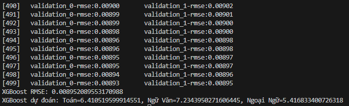

# Exam Score Prediction using Reinforcement Learning

[](https://www.python.org/downloads/release/python-3120/)
[](LICENSE)

## Overview

This project explores the application of Reinforcement Learning to predict student exam scores. The goal is to develop a model that can provide accurate predictions, assisting both students and educators in tracking academic progress and identifying areas for improvement.

## Table of Contents

- [Introduction](#introduction)
- [Technologies Used](#technologies-used)
- [Algorithms](#algorithms)
- [Dataset](#dataset)
- [Report](#report)

## Introduction

Predicting exam scores can be a valuable tool for students and educators. This project leverages Reinforcement Learning, a powerful machine learning technique, to build a predictive model. The model aims to learn from historical data and environmental feedback to accurately forecast student performance.

## Technologies

- Python (3.12+)
- TensorFlow
- Pandas, NumPy, Scikit-learn (for data processing and analysis)

## Algorithms

| Algorithm             | Type                                      | Advantages                                                                                                                                                                                                                            | Disadvantages                                                                                                                                                                                                                                             |
| --------------------- | ----------------------------------------- | ------------------------------------------------------------------------------------------------------------------------------------------------------------------------------------------------------------------------------------- | --------------------------------------------------------------------------------------------------------------------------------------------------------------------------------------------------------------------------------------------------------- |
| **XGBoost** | Gradient Boosting Decision Tree (GBDT)    | High performance, handles large datasets, robust parameter tuning, good at preventing overfitting.                                                                                                                                       | Can be computationally expensive, potentially slower than LightGBM.                                                                                                                                                                                                |
| **LightGBM** | Gradient Boosting Decision Tree (GBDT)    | Extremely fast performance, low memory consumption, good at handling categorical features, suitable for large datasets.                                                                                                                   | Prone to overfitting without careful parameter tuning, potentially lower accuracy than XGBoost in some cases.                                                                                                                                               |
| **DQN Policy Gradient** | Reinforcement Learning (RL)              | Suitable for continuous action spaces, effective for learning complex policies, handles sparse rewards.                                                                                                                                 | Difficult to train, low stability, requires careful parameter tuning, slow convergence.                                                                                                                                                                     |
| **DQN** | Reinforcement Learning (RL)              | Effective for discrete action spaces, relatively stable, can be trained efficiently with techniques like Experience Replay and Target Networks.                                                                                            | Not suitable for continuous action spaces, may struggle with complex policies, requires careful parameter tuning.                                                                                                                                               |

**Explanation:**

* **Algorithm:** The name of the algorithm.
* **Type:** The classification of the algorithm (e.g., GBDT, RL).
* **Advantages:** The strengths of the algorithm.
* **Disadvantages:** The limitations of the algorithm.

## Dataset

1.  **Get the csv file:**

    ```bash
    diem_thi_thpt_2024.csv
    ```

    (using any dataset for better train)

## Report
**XGBoost**
  


**LightLBM**


**DQN** try your self
